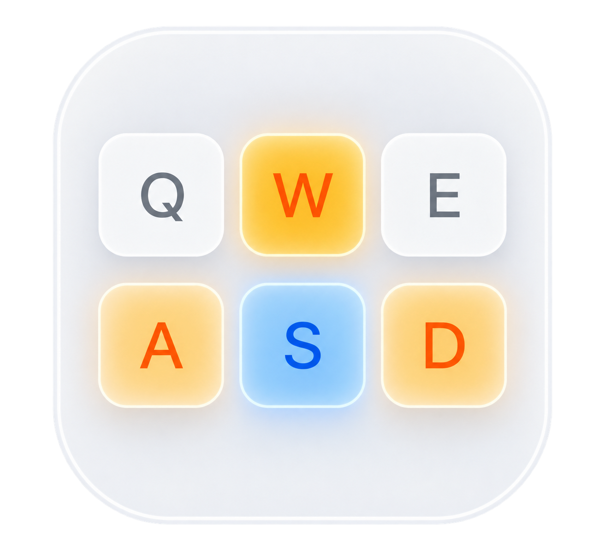
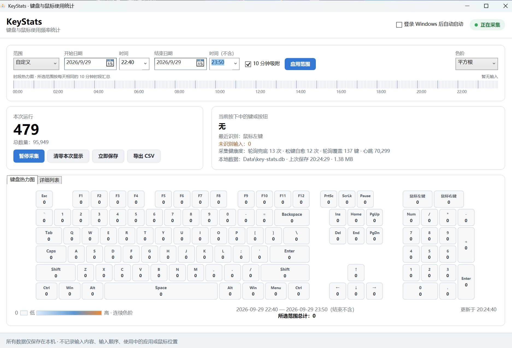
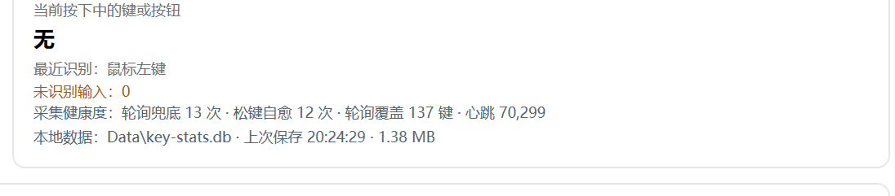

<div align="center">



# KeyStats

**Windows 本地键盘与鼠标使用频率统计工具 · 隐私优先 · 绿色免安装**

[](https://github.com/yangding233/KeyStats/actions/workflows/build.yml)


*Keystroke and mouse-button frequency statistics for Windows. Local-only: no content, no order, no window titles.*

</div>

---

## 这是什么

KeyStats 在后台统计你**按了哪些键、各按了多少次**，按分钟聚合保存到本地 SQLite 数据库，
再通过时间范围、144 段时段分布和全尺寸键盘热力图呈现使用习惯。

它**不记录输入内容、不记录按键顺序、不记录正在使用的应用、不记录鼠标位置**，也不需要账号、不联网、不上传任何数据。

## 界面



主窗口由四块组成：

| 区域 | 内容 |
| --- | --- |
| 顶部工具栏 | 时间范围（今天 / 最近 10 分钟 / 7 天 / 30 天 / 全部 / 自定义）、10 分钟吸附、色阶切换 |
| 时段热力图 | 所选范围按一天 144 个十分钟时段汇总，悬浮显示该时段累计次数 |
| 右侧状态卡 | 当前按下中的键或按钮、最近识别/未识别输入、**采集健康度**、本地数据状态 |
| 主热力图 + 详细列表 | 104 键全尺寸键盘热力图（含鼠标左右键），以及按区域分组的按键明细表 |

热力图与时段条使用同一套连续色阶（浅蓝 → 蓝 → 橙），键帽上直接显示次数，悬浮可看次数、占比与排名。

## 核心特性

- **双源采集**：Windows Raw Input 为主来源，`GetAsyncKeyState` 物理态轮询（约 60Hz）为兜底来源；
  两源共享一套去重状态，一次物理按下只计一次，同时保留多键盘各自计数；
- **能统计到"漏掉"的按键**：PrtSc（Windows 只发送它的松开事件）、被其它程序注册为全局热键的组合键
  （例如翻译工具的 `Shift+Z`）都能被兜底来源补计；
- **按下状态自愈**：所有可观测键都会用物理状态复核，避免某次丢失松开事件后该键永久不再计数；
- 键盘按键与鼠标左右键分别统计，左右 Ctrl / Shift / Alt 等物理键分开计数，长按连发自动去重；
- 每分钟聚合、按设置间隔自动保存，支持跨重启继续累计；
- 今天、最近 10 分钟、最近 7 天、最近 30 天、全部和自定义范围；
- 10 分钟时段分布、全尺寸键盘热力图、按键明细列表；
- CSV 导出（按分钟 × 键位）；
- 系统托盘后台运行、暂停采集、立即保存、完整退出；单实例运行；可选的当前用户登录自启动；
- 绿色版：数据目录跟随程序文件夹，整体复制即可迁移。

## 采集健康度



主界面右侧会显示一行"采集健康度"，用来判断采集是否完整：

- **轮询兜底**：Raw Input 没有投递、由物理态轮询补上的按键次数（PrtSc、被其它程序热键占用的组合键都会体现在这里）；
- **松键自愈**：纠正"丢失松开事件"的次数；
- **轮询覆盖 / 心跳**：轮询可观测的键数量，以及轮询线程的采样次数（心跳应持续增长）。

## 隐私原则

| 不记录 | 不依赖 |
| --- | --- |
| 输入内容 | 账号 / 注册 |
| 按键顺序 | 网络 / 服务器 |
| 正在使用的应用或窗口标题 | 云端同步 |
| 鼠标位置 | 管理员权限（普通权限即可采集） |

数据库只保存**每一分钟内各按键或按钮的累计次数**，不保存事件顺序。
数据位于程序旁的 `Data` 目录，删除该目录即彻底删除数据。详见 [docs/PRIVACY.md](docs/PRIVACY.md)。

## 快速开始

### 使用发行版

1. 下载并解压发行包（完整版自带运行时；轻量版需要 x64 .NET 10 Desktop Runtime）；
2. 双击 `KeyStats.exe` 即可开始采集；
3. 关闭主窗口后程序继续在托盘运行——**需要停止采集时请从托盘菜单选择"完整退出"**；
4. 若首次运行被 SmartScreen 拦截：点击"更多信息"→"仍要运行"（发行包未做代码签名）。

> 程序需要与同目录的原生库文件（`*.dll`）以及 `Data` 目录一起使用，请不要只把 `KeyStats.exe` 单独拷走；
> 整个文件夹可以直接移动到任意位置，数据会跟着一起走。

### 游戏兼容性

如果游戏以管理员权限运行，请以相同权限启动 KeyStats。部分采用独占输入或反作弊隔离的游戏不会向普通桌面程序提供输入事件，本项目不会尝试绕过反作弊机制。

## 构建与测试

需要 .NET 10 SDK（`global.json` 指定 10.0.400，允许同功能带的更新补丁版本）。

```powershell
dotnet restore .\KeyStats.slnx
dotnet build .\KeyStats.slnx -c Release --no-restore
dotnet run --project .\tests\KeyStats.Core.Tests -c Release --no-build   # 40 条回归测试
```

生成发行包（完整版 + 轻量版 + SHA-256）：

```powershell
.\scripts\publish.ps1
```

更多说明见 [docs/BUILDING.md](docs/BUILDING.md) 与 [docs/TESTING.md](docs/TESTING.md)。

## 目录结构

```text
src/KeyStats.Core/          键位模型、归一化、双源计数与按下状态自愈
src/KeyStats.Storage/       SQLite、分钟聚合、十分钟汇总、设置与 CSV 导出
src/KeyStats.App/           WPF 界面、Raw Input、物理态轮询、托盘生命周期
tests/KeyStats.Core.Tests/  无第三方测试框架的回归测试
docs/                       使用、构建、隐私与测试说明
scripts/                    发行包构建脚本
```

**采集链路**：`Raw Input（按设备 + 扫描码）` 与 `GetAsyncKeyState 轮询（按虚拟键，含物理别名）`
→ 共享去重与计数状态机 → 分钟聚合 → SQLite（`minute_buckets` 与派生表 `rollup_10m`）→ 界面 / CSV 导出。

## 常见问题

**为什么以前 PrtSc、以及 Shift+Z 之类的组合键统计不到？**
Windows 对 PrtSc 不发送"按下"事件，只发送一个假 Shift 以及它的"松开"；而被其它程序注册为全局热键的
组合键会在系统层被消费，Raw Input 根本收不到。这两类现在都由物理态轮询兜底补计，
可以在"采集健康度"里看到它们。

**某个键突然不再计数了？**
过去如果一次"松开"事件丢失，该键会被当成一直按着而不再计数。现在所有键都会被物理状态复核并自动恢复，
"松键自愈"计数即为此类纠正的累计次数。

**为什么发行包会被 SmartScreen 警告？**
因为当前发行包没有代码签名，属于"未知发布者"。点"更多信息"→"仍要运行"即可。

**数据在哪里？能迁移吗？**
在程序旁的 `Data\key-stats.db`。完整复制程序文件夹即可迁移；数据库只保存聚合次数，不含输入内容或顺序。

## 参与贡献

提交问题或代码前请阅读 [CONTRIBUTING.md](CONTRIBUTING.md)；安全相关问题请参考 [SECURITY.md](SECURITY.md)。

## 许可证

本项目基于 [MIT 许可证](LICENSE) 开源，版权所有 (c) 2026 yangding233。

## 第三方组件

项目使用 Microsoft.Data.Sqlite 与 SQLitePCLRaw，详情见 [THIRD_PARTY_NOTICES.md](THIRD_PARTY_NOTICES.md)。
